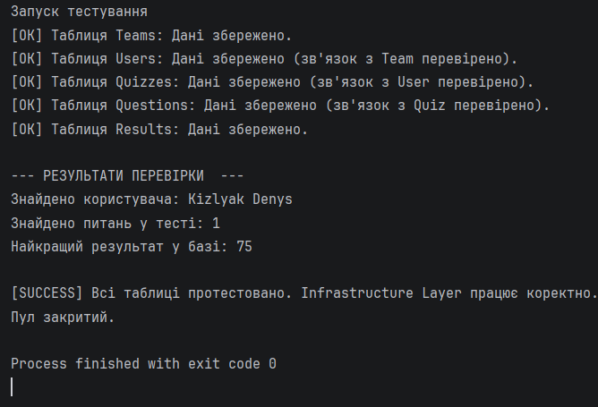

# 🎓 Quiz System (Навчальний проєкт)

[](https://www.oracle.com/java/)
[](https://github.com/0k-8/quiz_system/actions)

Цей проєкт розробляється в рамках **практичного вивчення** мови Java та принципів побудови архітектури корпоративних додатків.

---

## 🏗 Поточний стан

Проєкт реалізовано з використанням архітектури **MVVM** та багатошарової структури (**DAO**, **Service**, **View**). 
- **База даних**: H2 (Embedded) з автоматичними міграціями через **Flyway**.
- **Інтерфейс**: JavaFX 22.
- **Безпека**: Хешування паролів через **jBCrypt**.

---

## 🚀 Як завантажити та запустити (Для користувачів)

Ви можете завантажити готову програму, яка **не потребує встановлення Java** на ваш комп'ютер:

1. Перейдіть на сторінку **[Останнього релізу](https://github.com/0k-8/quiz_system/releases/latest)**.
2. Завантажте архів для вашої операційної системи:
   - `QuizSystem-Windows.zip` — для Windows.
   - `QuizSystem-macOS.zip` — для macOS.
   - `QuizSystem-Linux.zip` — для Linux.
3. Розпакуйте архів у зручне місце.
4. Запустіть файл:
   - **Windows**: `QuizSystem.exe`
   - **macOS/Linux**: `QuizSystem`

---

## 🛠 Технологічний стек

- **Java 22**
- **JavaFX 22** (Графічний інтерфейс)
- **H2 Database** (Вбудована БД)
- **Flyway** (Міграції БД)
- **Maven** (Збірка та керування залежностями)
- **GitHub Actions** (Автоматична збірка релізів)

---

## 🔧 Розробка та запуск з вихідного коду

### Вимоги:
- JDK 22 або новіша.
- Maven 3.9+.

### Команди:
1. **Збірка проєкту**:
   ```bash
   mvn clean package
   ```
2. **Запуск через Maven**:
   ```bash
   mvn exec:java -Dexec.mainClass="com.kizlyak.Launcher"
   ```
3. **Створення локальної збірки (Portable)**:
   ```bash
   mvn clean install
   ```
   Після виконання папка з готовою програмою буде в `dist/QuizSystem`.

---

## 📊 Скріншоти



---
*Проєкт створено для портфоліо та відточування навичок розробки на Java.*
